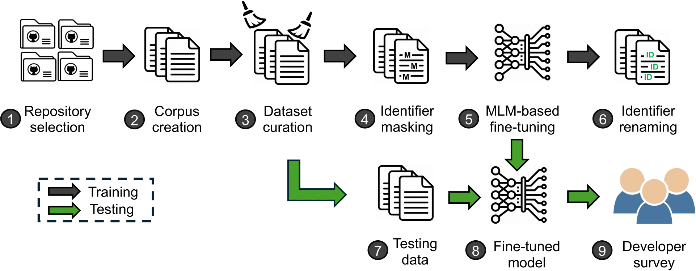
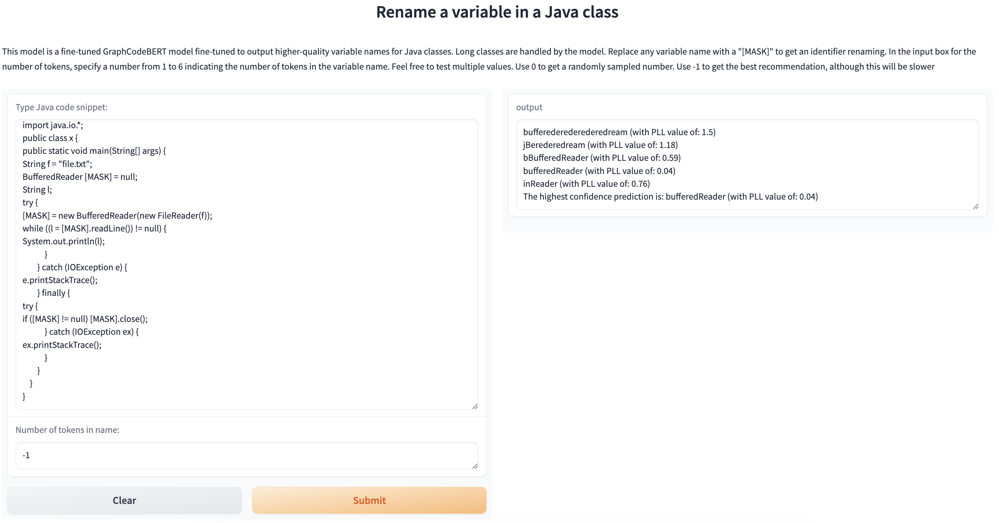

# Enhancing Identifier Naming Through Multi-Mask Fine-tuning of Language Models of Code

Accepted at: 24th IEEE International Conference on Source Code Analysis and Manipulation.

## Abstract

> Code readability strongly influences code comprehension and, to some degree, code quality. Unreadable code makes software maintenance more challenging and is prone to more bugs.
To improve the readability, using good identifier names is crucial.
Existing studies on automatic identifier renaming have not considered aspects such as the code context. 
Additionally, prior research has done little to address the typical challenges inherent in the identifier renaming task. 
In this paper, we propose a new approach for renaming identifiers in source code by fine-tuning a transformer model.
Through the use of perplexity as an evaluation metric,
our results demonstrate a significant decrease in the perplexity values for the fine-tuned approach compared to the baseline, reducing them from $363$ to $36$. To further validate our method, we conduct a developers' survey to gauge the suitability of the generated identifiers, comparing original identifiers with identifiers generated with our approach as well as two state-of-the-art large language models, GPT-4 Turbo and Gemini Pro. Our approach generates better identifier names than the original names and exhibits competitive performance with state-of-the-art commercial large language models.
The proposed method carries significant implications for software developers, tool vendors, and researchers.
Software developers may use our proposed approach to generate better variable names, increasing the clarity and readability of the software.
Researchers in the field may use and build upon the proposed approach for variable renaming.



### Project Structure

1. `data`: Contains scripts related to data handling. This includes downloading raw data and creating the training and test datasets:  
    - `SelectedRepositories.csv`: CSV file containing the repositories that were selected based on the criteria mentioned in the manuscript.  
    - `repos_download.py`: a script used to download repositories as zip files, extract their content, and copy all `.java` files in the specified directory.  
    - `dataset_creation.py`: converts raw data generated by `repos_download.py` into CSV files for training and testing, respectively.
    - `training`: contains the training dataset stored in CSV files that we generated.
    - `testing`: contains the CSV file of the testing dataset that we generated.

2. `training`: Contains scripts used to train the model using the method described in the manuscript:
    - `variable_predictor.py`: script used to train the model.

3. `evaluation`: Contains scripts used to train the model using the method described in the manuscript:
    - `model_eval.py`: script used to evaluate the model.
    - `ChatGPT_identifiers.py`: script used to run experiments that involve GPT4 mentioned in the manuscript.

4. `survey_codes`: Contains the code snippets that were used in the survey described in the manuscript.

5. `figures`: Contains figures that are displayed in the README.


### Enviornment Setup and Requirements

To run the scripts in this replication package, you need a machine with a Python version of `3.10` or above. The experiments were run on a machine equiped with an AMD Rome 7532 64-core CPU, 490 GB of CPU memory and an Nvidia V100. Please note that a machine with much less resources (e.g. with a 16GB of RAM, and consumer grade GPU such as `RTX3090`) should be enough.

First, create a new Python virtual enviornment and install the required dependencies,
```bash
python3 -m venv venv
source venv/bin/activate
pip3 install -r requirements.txt
```

If you are running a machine with a Windows OS, run the following command instead of the second one mentioned above,

```bash
.\venv\Scripts\activate
```

**N.B**: Throughout the subsequent steps, make sure that the virtual enviornment is activated (i.e. executing the `source` command if you are on a Unix-based system or as described if you are running Windows).

## Part 1: Dataset creation

This part invovles the steps needed to generate training and testing from scratch. We have also included the training and testing samples if you wish to skip these steps. It is recommended that you first read all of the steps before executing them.

1. First step includes donwloading the repositories. This is done by executing the `data/repos_download.py` script as follow (assuming you are in the root directory of the project),
```bash
python3 data/repos_download.py \
--csv_file ./data/SelectedRepositories.csv \
--output_dir ./data/Dataset/inp-txt
```

Note that you can change the value of `output_dir` to your preference. After this script is done executing, the folder specified in `output_dir` will contain a set of `.java` files that will be used in the second step to generate training and test samples.

2. Generate the training and testing CSV files using `data/dataset_creation.py`. The script generates the full dataset first, then the training and testing data points are randomly sampled from it.

```bash
python3 data/dataset_creation.py \
--raw_data_path ./data/Dataset/inp-txt \
--output_dir ./data
```

Note that the value of `raw_data_path` should be the same as `output_dir` from the previous step. Upon successful exceution, two files named `train.csv` and `test.csv` will be saved in the directory specified in `output_dir`.  

We included the training and test samples that we have used in our study, i.e. the ones sampled from the full dataset. The training samples are divided into 3 CSV files in `data/training` given Github's size restriction. To combine them into one file called `train.csv` you can use the following Unix command,
```bash
cd data/training
head -n 1 $(ls *.csv | head -1) > train.csv
tail -n +2 -q *.csv >> train.csv
```

As for the test samples, they can be found in `data/testing/test.csv`
 
## Part 2: Training 

1. To train the model, execute the following command,

```bash
python3 training/variable_predictor.py \
--training_csv_file data/training/train.csv
```

Where `training_csv_file` is the CSV file containg the training samples that was generated in Part 1.2. Alternatively, you could use the file that we have provided in the same section. The model's checkpoints will be saved in `training/var_runs`.
 
## Part 3: Evaluation 
1. Model evaluation is done through the `evaluation/model_eval.py`,
```bash
python3 evaluation/model_eval.py \
--testing_csv_file data/testing/test.csv
--checkpoint training/var_runs/<CHECKPOINT-NAME>
```

We also provide the model checkpoint hosted on [Huggingface](https://huggingface.co/spaces/anon903/ReIdentify/tree/main?clone=true). To clone the repository, make sure to have `git lfs` installed on your machine. You can do so by following the official [documentation](https://git-lfs.com/).
Once `git lfs` is properly installed, executing these commands,

```bash
git lfs install
git clone https://huggingface.co/spaces/anon903/ReIdentify
```

The checkpoint name is `model_26_2` and the evaluation can be executed as follow,
```bash
python3 evaluation/model_eval.py \
--testing_csv_file data/testing/test.csv
--checkpoint ReIdentify/model_26_2
```

2. GPT4 evaluation: In the paper, we have run experiments to compare our model's performance in generating identifier names compared to GPT4 on the same test set mentioned in previous sections.  
Specifically, we used OpenAI's API service, hence, you will need an [OpenAI API key](https://platform.openai.com/docs/api-reference/authentication).

```bash
python3 evaluation/ChatGPT_identifiers \
--test_csv_file data/testing/test.csv
--api_key <API-KEY>
```

**N.B**: There were several new deployment of the GPT4 model after this work submitted and the experiments were conducted. As result, you may observe different results.

## Part 4: Online Inference

To facilitate ease of use and accessibility, we have deployed our model the HuggingFace platform. This deployment enables users to utilize the model directly through Hugging Face's interface, eliminating the need for local installation and setup, i.e. you would not have to execute the Part 3.1 step.



To generate a new identifier name of a variable in a given Java code snippet, replace all of the occurences of that identifier name with the `[MASK]` value. You can specify the number of subtokens that will be used in generation by entering a value between 1 and 6. Use the value `-1` for the number of subtokens in order to get the best possible recommendation.